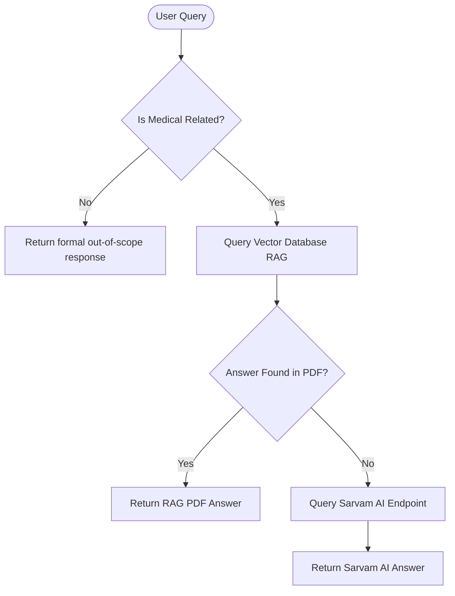

# 🏥 MediBot AI - Medical RAG Chatbot

MediBot AI is an advanced, production-ready AI Medical Chatbot designed to answer medical and health queries. It implements **Retrieval-Augmented Generation (RAG)** over a custom medical book/PDF and integrates a **hybrid dual-engine architecture** with **Sarvam AI** for seamless fallbacks and **indic-language optimization**.

---

## 🚀 Key Features

*   **🧠 Intelligent Medical Classifier**: Evaluates incoming queries using the LLM to identify non-medical/irrelevant topics, responding instantly with a formal out-of-scope notice to prevent hallucinations and abuse.
*   **📚 Custom PDF Context RAG**: Indexes and retrieves information from local medical literature/PDFs via **Pinecone Vector Database** and **HuggingFace Embeddings**.
*   **🔗 Hybrid Routing Fallback**: If the requested answer is not found in the custom PDF context, the query is automatically routed in real-time to **Sarvam AI's Chat Completion API** (`sarvam-30b`/`sarvam-105b`).
*   **🌐 Indic-Language Optimized**: Leveraging Sarvam AI's models allows the chatbot to support and answer complex medical queries in **English and 10 Indic languages** (Hindi, Tamil, Telugu, etc.) with high efficiency.
*   **📦 Double-Engine Auth**: Dual-header fallback (`api-subscription-key` & `Bearer`) to ensure robust authentication across all Sarvam AI tiers.

---

## 🗺️ Architectural Flow

Here is the underlying decision-making pipeline for every user query:



---

## 🛠️ Tech Stack

*   **Backend Framework**: Flask (Python)
*   **LLM Orchestrator**: LangChain / LangChain-Classic
*   **Primary LLM**: Google Gemini (`gemini-2.0-flash`)
*   **Fallback LLM**: Sarvam AI (`sarvam-30b` / `sarvam-105b`)
*   **Vector Database**: Pinecone
*   **Embeddings Model**: Sentence-Transformers (`all-MiniLM-L6-v2`)

---

## ⚙️ Environment Configuration

Create a `.env` file in the root directory (based on [.env.example](file:///E:/drive%20d/AI%20projects/Medical-Chatbot-AI/.env.example)):

```ini
PINECONE_API_KEY=your_pinecone_api_key
GEMINI_API_KEY=your_google_gemini_api_key
SARVAM_API_KEY=your_sarvam_api_key
SARVAM_MODEL=sarvam-30b  # Optional: defaults to sarvam-30b
```

---

## 💻 Local Setup & Installation

### 1. Clone the Repository
```bash
git clone https://github.com/your-username/medical-chatbot-ai.git
cd medical-chatbot-ai
```

### 2. Set Up a Virtual Environment
```bash
python -m venv venv
# On Windows
.\venv\Scripts\activate
# On macOS/Linux
source venv/bin/activate
```

### 3. Install Dependencies
```bash
pip install -r requirements.txt
```

### 4. Index your PDF (Optional)
Put your PDF in the `Data/` folder and run the indexing script to build your vector database:
```bash
python store_index.py
```

### 5. Run the Application
```bash
python app.py
```
Open your browser and visit `http://localhost:8080` to interact with your medical chatbot.

---

## 🐳 Docker & Cloud Deployment

This repository is optimized for one-click serverless deployments on platforms like **Hugging Face Spaces**, **Render**, or **Koyeb**.

### Run locally using Docker
```bash
# Build the image
docker build -t medical-chatbot .

# Run the container
docker run -p 7860:7860 \
  -e PINECONE_API_KEY="your_key" \
  -e GEMINI_API_KEY="your_key" \
  -e SARVAM_API_KEY="your_key" \
  medical-chatbot
```

### Hugging Face Spaces Deployment
This repository includes a [Dockerfile](file:///E:/drive%20d/AI%20projects/Medical-Chatbot-AI/Dockerfile) and is configured to run out-of-the-box on Hugging Face Spaces with **16GB of Free RAM**:
1. Create a new Space on Hugging Face and select **Docker** (Blank template).
2. Go to **Settings** and add your `PINECONE_API_KEY`, `GEMINI_API_KEY`, and `SARVAM_API_KEY` as encrypted secrets.
3. Push your repository to your Space:
   ```bash
   git remote add hf https://huggingface.co/spaces/YOUR_USERNAME/YOUR_SPACE_NAME
   git push -u hf main --force
   ```
